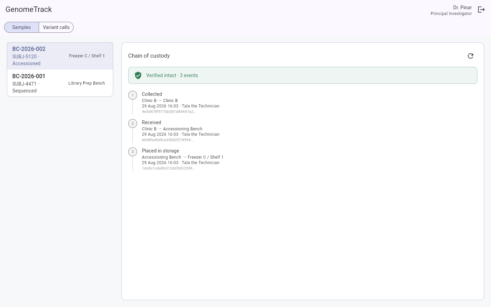
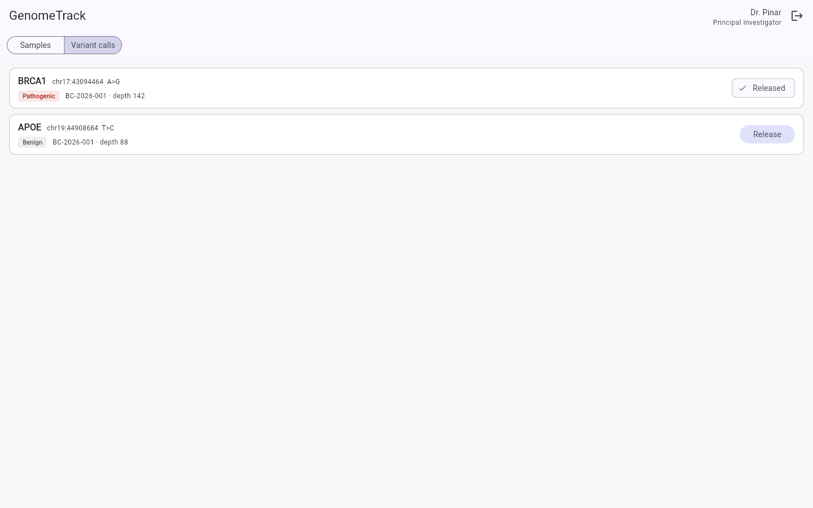
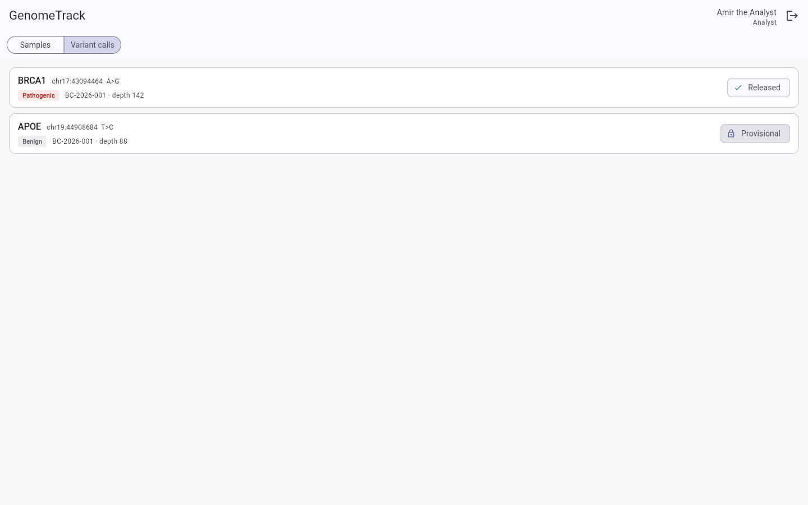
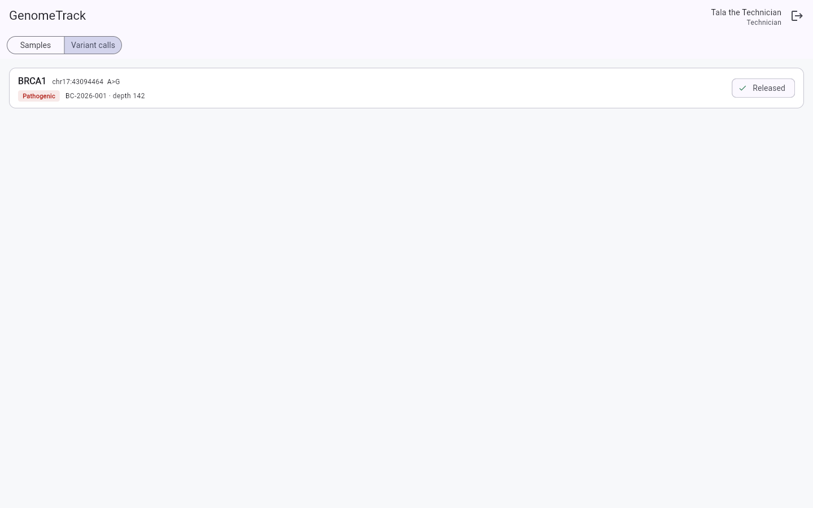

# GenomeTrack

Sample chain of custody, sequencing runs, and variant release for a genomics lab.
**ASP.NET Core 9 · PostgreSQL · EF Core · Docker**

A lab's software has one job the rest of the industry does not: it has to be able to prove,
months later, that a result came from the sample it says it came from. GenomeTrack is built
around that requirement rather than around CRUD.

---

## Why this exists

I studied biochemistry before I moved into software. Lab systems I saw treated custody as a
log table — a row you write and hope nobody edits. A log table with an `UPDATE` privilege on it
is not evidence of anything.

So the custody trail here is **hash-chained and append-only**. Each event stores a hash of its
own contents plus the hash of the event before it. Editing history is detectable, and the
verifier says exactly which link broke and how.

### Seeing it work

A chain nobody has touched:


Now edit one row straight in the database, the way anyone with a `psql` prompt could:

```sql
UPDATE custody_events SET "ToLocation" = 'Freezer B / Shelf 9' WHERE "Sequence" = 3;
```

No API call, no application code involved. The next verification says which link broke and why
— and the timeline itself now contradicts: event 3 claims the sample went to Freezer B, while
event 4 still departs from Freezer A.



### The same call, seen by three roles

Release is the point of no return, so only a principal investigator can do it. Everyone else
sees the state, not the button — and a technician does not see a provisional interpretation at
all. The API enforces all of this; the client only reflects it.

| Principal investigator | Analyst | Technician |
|---|---|---|
|  |  |  |
| Can release | Sees it, cannot release | Never sees the unreleased one |

## The rules the domain enforces

These are the parts worth reading; the CRUD around them is unremarkable.

| Rule | Why it exists |
|---|---|
| A sample must be **accessioned** before it can join a run | Sequencing material the lab never confirmed receiving is how results get attributed to the wrong subject |
| The custody chain **opens at collection**, not at arrival | A sample lost in transit is the case the chain most needs to describe |
| An event's `from` is read from the **sample**, never the caller | A client-supplied origin lets a gap be papered over |
| Custody events are **append-only** — enforced in `SaveChanges` | Corrections are appended, which is what an auditor expects to see anyway |
| Only a **principal investigator** may release a result | Release is the point of no return: once a call leaves the lab it informs care |
| A call can only be released from a **completed** run | A call from a failed run is an artefact, not a finding |
| A **technician** never sees an unreleased call | Provisional interpretations stay inside the analyst boundary |
| Two samples cannot share a **lane**; a re-run creates a **new** call | Keeps re-analysis history intact instead of overwriting it |
| Timestamps are **truncated to milliseconds** before hashing | See "Two bugs worth keeping" below |

---

## Running it

```bash
docker compose up -d --build          # API + PostgreSQL
open http://localhost:8080/swagger
```

The reference client is a Flutter web app in `client/`:

```bash
cd client
flutter pub get
flutter run -d chrome --web-port 8081   # the API allows this origin in development
```

Three seeded accounts, all with password `Passw0rd!` (Development only — the seeder refuses to
run in any other environment):

| Email | Role | Can |
|---|---|---|
| `tech@genometrack.local` | Technician | Register, accession, move samples |
| `analyst@genometrack.local` | Analyst | Everything above, plus runs and calls |
| `pi@genometrack.local` | PrincipalInvestigator | Everything, plus **release** |

```bash
dotnet test                 # 28 unit tests
cd client && flutter analyze
```

---

## Architecture

Service classes behind interfaces, resolved by DI. No mediator, no CQRS — the domain is not
CQS-shaped and the indirection would cost more than it returns here.

```
Domain/           Entities and enums. No dependencies.
Application/      DTOs, service interfaces + implementations, Result envelope.
                  Depends on Domain and on EF Core abstractions only.
Infrastructure/   DbContext, EF configurations, migrations, hashing, seeders.
API/              Controllers, JWT, policies, middleware.
UnitTest/         28 tests over the rules above.

client/           Flutter web reference client. Cubits over a single ApiClient,
                  no business rules of its own — it renders what the API allows.
```

Every endpoint answers the same envelope, including 401 and 403 — those short-circuit in
middleware before a controller runs, so they are given the envelope explicitly rather than
leaving clients a second parse path.

```json
{ "isSuccess": true, "message": "Success", "data": { } }
```

---

## Two bugs worth keeping in the history

Both were found by running the thing, not by reading it, and both are the kind that pass unit
tests and fail in production.

**Timestamp precision.** `DateTimeOffset` counts 100-nanosecond ticks. PostgreSQL `timestamptz`
stores microseconds. Hashing the un-rounded value and letting the database round it on write
produced rows that could not reproduce their own hash — *every* chain verified as broken at its
first link, on data nobody had touched. In-memory tests never round, so they were green the
whole time. Fixed by truncating to milliseconds before the value is hashed or stored, which
holds at any precision a mainstream database offers.

**Entity state on a navigation add.** `BaseEntity` assigns its own `Guid`, so by the time change
detection saw a `RunSample` added through `run.RunSamples`, its key was already populated. EF
read that as an existing row, tracked it `Modified`, and failed on save with
*"Attempted to update or delete an entity that does not exist in the store."* Fixed by adding
through the `DbSet` so the state is set explicitly.

There is also a design note in `AppDbContext`: this model deliberately has **no global
soft-delete query filters**. EF turns a filter into an inner join across a required navigation,
so a soft-deleted actor silently removes every custody event referencing them. A vanished audit
row is the worst failure this system has, and it fails quietly. Each service filters
`IsDeleted` explicitly instead.

---

## Stack

**API** — ASP.NET Core 9 · EF Core 9 · PostgreSQL 16 · JWT (HS256) · Serilog · Swagger/OpenAPI ·
xUnit + FluentAssertions · Docker Compose · GitHub Actions

**Client** — Flutter 3 · flutter_bloc (Cubit) · http · Material 3

CI builds with `-warnaserror`, runs the test suite, and rebuilds the image on every push.
